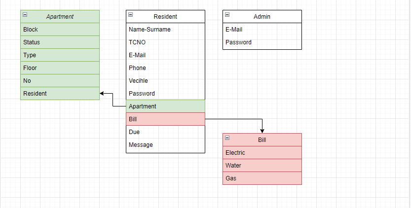
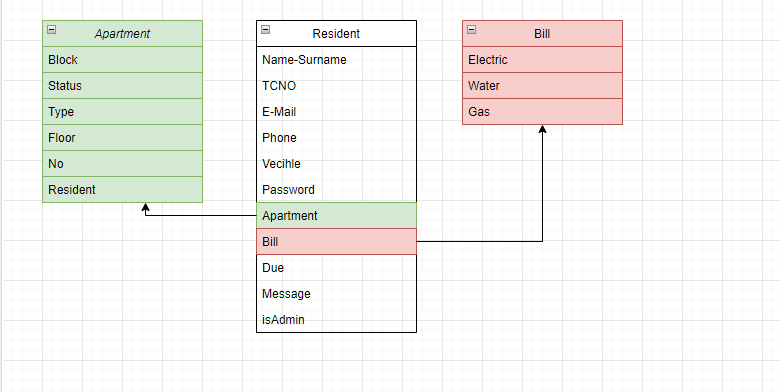
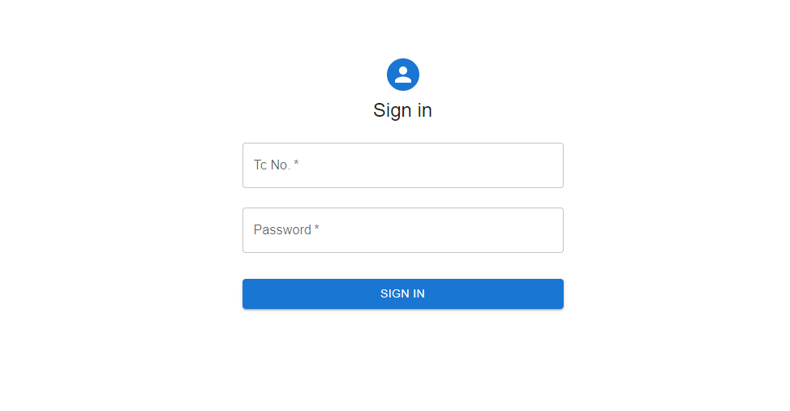
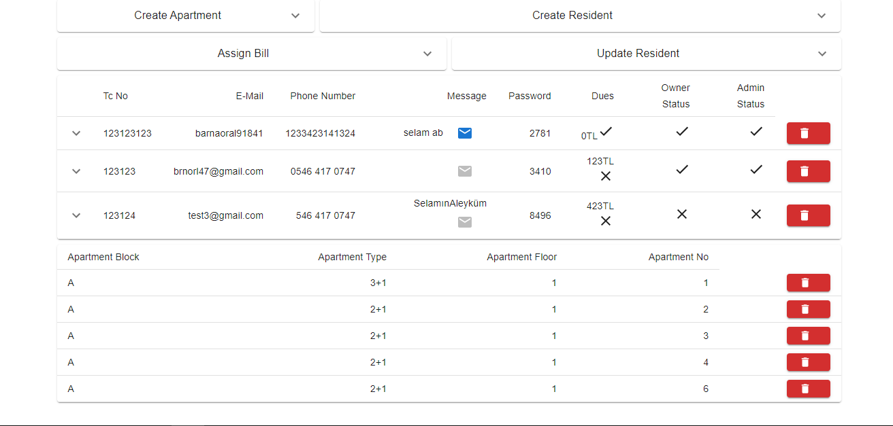
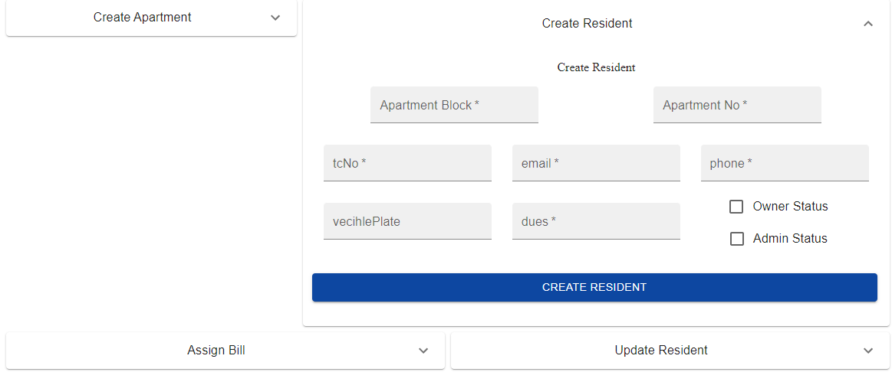
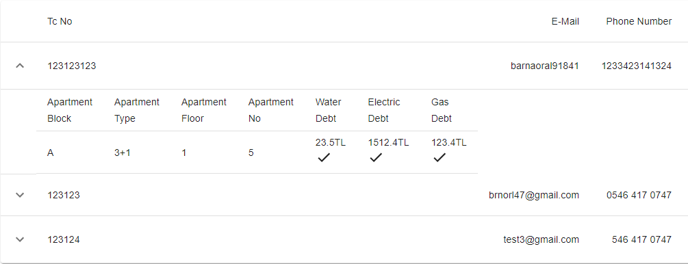
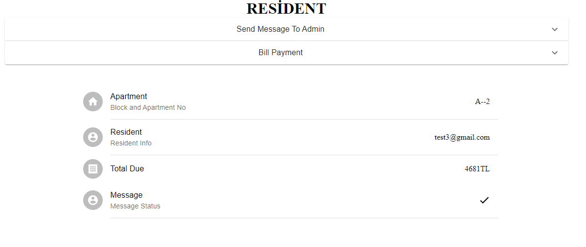
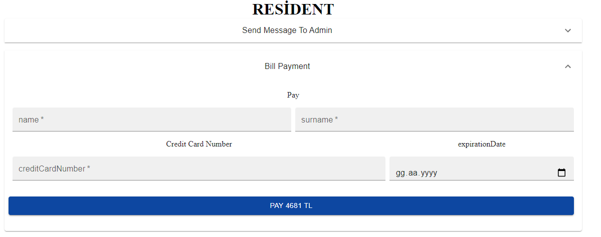

# Ödev Hikayesi
### Apartman sitesi için yönetim sistemi.Adminler tarafından fatura,kullanıcı ve daire bilgileri girilip kullanıcının admine mesaj gönderebildiği ve ödeme yapabildiği temel sistem.
# Veritabanı Normalizasyonu

  
1NF

  

  
2NF

  
  Admin için ayrı bir tablo yerine bool olarak isAdmin kontrolü ekledim.

# Backend (.net Core)

## Kullanılan Veritabanları
*  MS SQL Server
*  MongoDB
## Kullanılan Paketler-Teknolojiler
*  Entity Framework Core
*  AutoMapper
*  Memory Caching
*  Swagger 

  
Modeller

  

  
Daire Modelleri

### View Model
        public bool Occupied { get; set; }
        public string Block { get; set; }
        public string Type { get; set; }
        public int Floor { get; set; }
        public int No { get; set; }
        public virtual ICollection<ResidentInApartmentModel> Residents { get; set; }
### Create Model
        public bool Occupied { get; set; }
        public string Block { get; set; }
        public string Type { get; set; }
        public int Floor { get; set; }
        public int No { get; set; }
### Update Model
        public bool Occupied { get; set; }
        public string Type { get; set; }
### List Model
        public List<T> apartmentList { get; set; }

  
Kullanıcı Modelleri

  ### View Model
        public string TcNo { get; set; }
        public string Email { get; set; }
        public string Phone { get; set; }
        public string VecihlePlate { get; set; }
        public string Password { get; set; }
        public int? ApartmentId { get; set; }
        public int? BillId { get; set; }
        public decimal? Dues { get; set; }
        public bool? DueIsPaid { get; set; }
        public string Message { get; set; }
        public bool? MessageIsRead { get; set; }
        public bool IsDeleted { get; set; }
        public bool IsActive { get; set; }
        public bool IsOwner { get; set; }
        public bool? IsAdmin { get; set; }
        public virtual ApartmentViewModel Apartment { get; set; }
        public virtual CreateBillModel Bill { get; set; }
  ### Create Model
        public string TcNo { get; set; }
        public string Email { get; set; }
        public string Phone { get; set; }
        public string VecihlePlate { get; set; }
        public decimal? Dues { get; set; }
        public bool? DueIsPaid { get; set; }
        public string Message { get; set; }
        public bool? MessageIsRead { get; set; }
        public bool IsOwner { get; set; }
        public bool? IsAdmin { get; set; }
  ### Login Model
        public string TcNo { get; set; }
        public string Password { get; set; }
  ### Resident-in-Apartment Model
        public string Email { get; set; }
        public string Phone { get; set; }
        public string VecihlePlate { get; set; }
        public string Message { get; set; }
        public bool IsOwner { get; set; }
Bu model Daire listemelerinde kolaylık için oluşturuldu.
  ### Update Model
        public string Email { get; set; }
        public string Phone { get; set; }
        public string VecihlePlate { get; set; }
        public decimal? Dues { get; set; }
        public bool? DueIsPaid { get; set; }
        public string Message { get; set; }
        public bool? MessageIsRead { get; set; }
        public bool IsOwner { get; set; }
        public bool? IsAdmin { get; set; }

  
Ödeme-Fatura

  ### Bill Model
        public decimal Water { get; set; }
        public decimal Electric { get; set; }
        public decimal Gas { get; set; }
        public bool WaterIsPaid { get; set; }
        public bool ElectricIsPaid { get; set; }
        public bool GasIsPaid { get; set; }

### Payment Model (MongoDB için)
        public string Name { get; set; }
        public string Surname { get; set; }
        public decimal Amount { get; set; }
        public string CreditCardNumber { get; set; }
        public DateTime ExpirationDate { get; set; }
        public DateTime PaymentDate { get; set; }
  

  
API'lar

  
  ## Daire API'ları
  #### Temel CRUD işlemleri
  * Create Apartment
  * Get Apartment
  * Update Apartment
  * Delete Apartment
  ## Kullanıcı API'ları
  * Create Resident(Assign to Apartment)
  * Get Resident
  * Update Resident
  * Delete Resident
  * Assign Bill Resident
  * Login
  * Send Message
  * Payment (MongoDB)

# Frontend (React.js)
## Kullanılan Paketler-Teknolojiler
*  Material - UI
*  Axios

## Giriş Paneli
  

## Admin Paneli
  

Yaratma ve Güncelleme formlarını açılır pencere olarak tasarladım.

## Kullanıcı Yaratma
  

## Kullanıcı Listesi Ayrıntıları
  

Kullanıcının daire ve fatura bilgilerini liste içinde açılır pencere olarak tasarladım.

## Kullanıcı Paneli

* Daire Bilgileri
* Kullanıcının Kendi Bilgileri
* Kullanıcının Toplam Borcu
* Gönderdiği Mesajın Durumu

## Kullanıcı İşlemleri

* Kredi Kartı ile toplam borcu ödeme
* Admine Mesaj Gönderme

##### Bu ödev Gelecek Varlık & Patika.dev Fullstack Bootcampinin bitirme projesidir. @brnorl